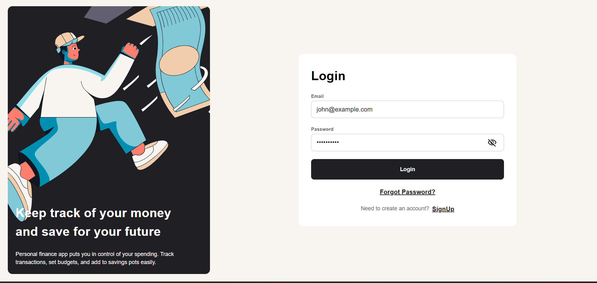
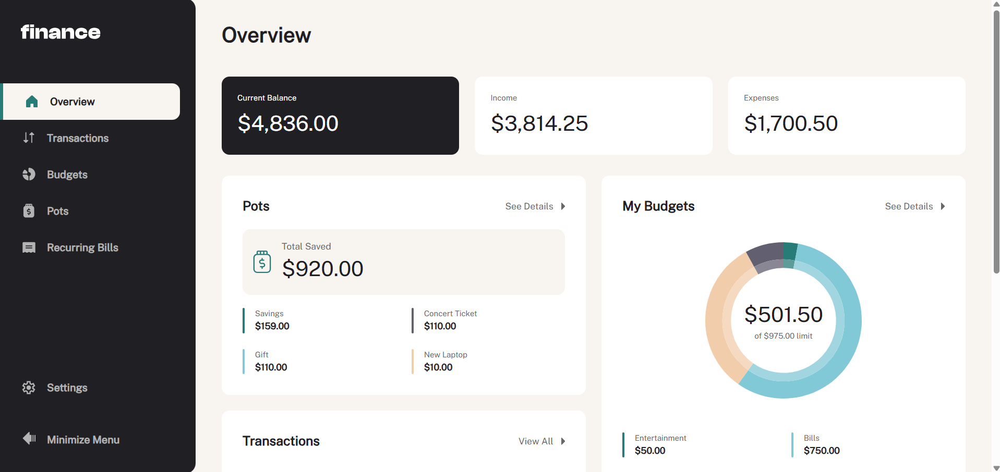
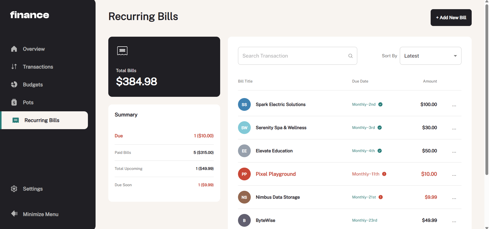

# Personal Finance App (Frontend)

Personal Finance App is a **web application** designed to help users manage **budgets**, **savings**, **recurring bills**, and **transactions** efficiently. This repository contains **only the frontend** portion of the application, built using **React**, **React Router**, **React Hook Form**, **Yup**, **MUI**, **TypeScript**, and **Vite**. It provides an intuitive, responsive interface for effective personal finance tracking and management.

## Features

- **User-Friendly Dashboard**  
  Displays total budgets, saving pots, recent transactions, and progress toward saving goals.

- **Transactions Management**

  - View all transactions with pagination (10 per page).
  - Search, sort, and filter transactions to find exactly what you need.

- **Budgets & Saving Pots**

  - **Create, Read, Update, Delete (CRUD)** budgets and savings.
  - Real-time savings progress tracking with clear progress indicators.

- **Recurring Bills**

  - Log recurring bills with their statuses.
  - Search, sort, and track current month’s bills easily.

- **Form Validation & Accessibility**

  - Uses **React Hook Form** and **Yup** for secure, robust validation.
  - Keyboard navigation, hover, and focus states enhance accessibility.

- **Responsive Design**

  - Optimized layout for **mobile**, **tablet**, and **desktop** devices.

- **Axios Integration**
  - Streamlines API requests to the backend (not included in this repo).

---

## Running the Project Locally

Follow the steps below to run the frontend locally on your machine:

1. **Clone the Repository**


2. Install Dependencies

```cmd
npm install
```

3. Start the Local Development Server

```cmd
npm run dev
```

## Project Previews

Below are some highlights of the interface and features:



- Overview Dashboard – Central hub showing budgets, savings progress, and recent transactions.
  

- Saving Pots – Create and manage savings efficiently.
  

- Recurring Bills – Monitor your bills and see which are paid or due this month.
  